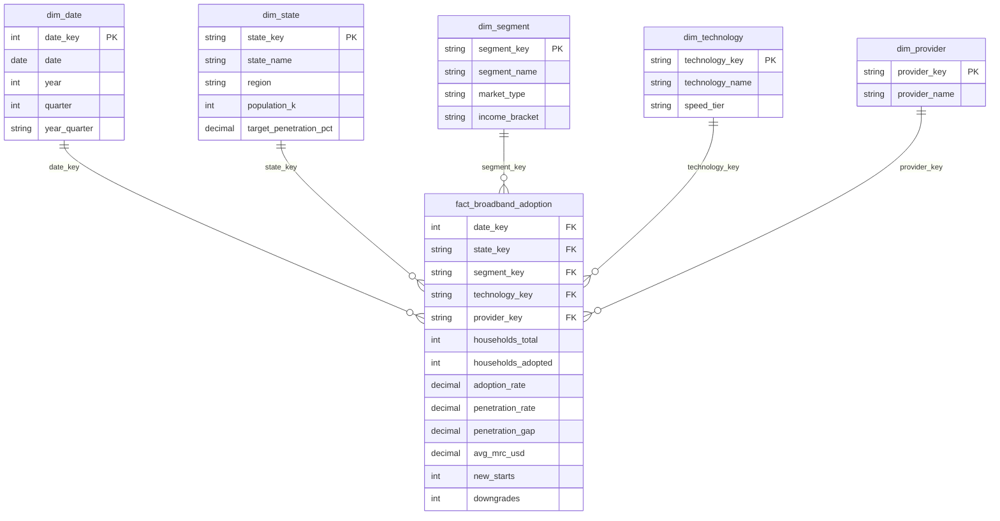

# Star-schema data model

**Broadband Adoption Executive BI** · 24 states · March 2026

## Architecture

## Design principles

| Principle | Implementation |
|-----------|----------------|
| **Star schema** | Single fact table; conformed dimensions; no snowflaking |
| **Grain** | One row per state × segment × technology × provider × month |
| **Additive facts** | Households, new starts, downgrades |
| **Semi-additive** | Adoption/penetration rates — use measures, not SUM in visuals |
| **Role-playing** | `dim_date` supports YoY via `SAMEPERIODLASTYEAR` |

## Executive metrics

| Metric | Definition |
|--------|------------|
| **Adoption rate** | Adopted households ÷ total households |
| **Penetration** | Service reach beyond base adoption (basket uplift) |
| **Penetration gap** | Penetration − adoption (upsell / bundle opportunity) |
| **YoY trend** | Current quarter vs prior year same quarter |

## Data volume

- **States:** 24
- **Months:** 39 (Jan 2023 – Mar 2026)
- **Fact rows:** ~150K+ (sparse cross-product of dimensions)

Regenerate: `python scripts/generate_data.py`
